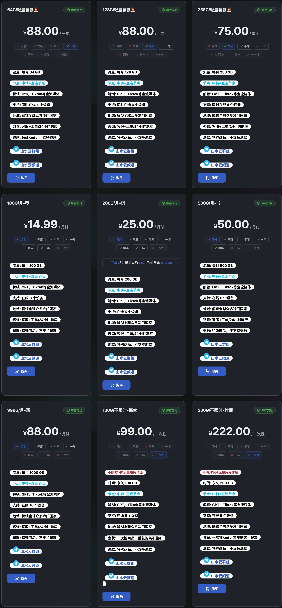

# 山水云机场官网最新地址+优惠码

山水云机场官网最新地址：[点击访问](https://c.jichangs.com/shanshui)

## 山水云机场简介

推荐：88元/年，64GB/月的高性价比套餐

山水云主打低价年付方案，适合预算敏感、但仍然需要流媒体解锁与多地区节点的用户。

## 核心亮点

- 最低 88 元/年，折合约 7.33 元/月
- 每月 64GB 流量
- 节点类型：中转 + 直连
- 解锁：GPT、TikTok 等全流媒体
- 同时在线：4 个设备
- 支持客服 + 工单，24 小时响应

## 节点覆盖

香港、美国、日本、新加坡、台湾、加拿大、法国、德国、英国、印尼、泰国、越南、菲律宾、韩国、土耳其、柬埔寨、迪拜、俄罗斯、马来西亚、阿根廷、巴西。

## 套餐参考

| 套餐 | 价格 | 说明 |
| --- | --- | --- |
| 年付轻量包 | 88元/年 | 每月64GB |

